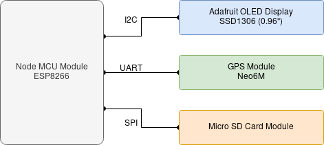
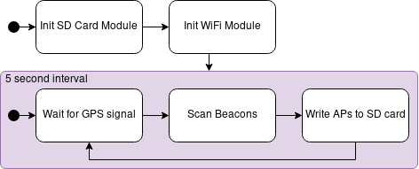

# Building an AP-Scanner for Warwalking

This project utilizes the ESP8266 on a Node MCU to detect wireless access points. A Neo 6M GPS modul keeps track of the location while a small OLED display allows for realtime status updates on the scanner. Gathered details are saved to a connected micro SD card for later evaluation. 

## Setup

Below is a connection diagram of all the parts for the AP-Scanner.

The parts are connected using the following pins:
* Display **I2C** (3V3)           
    * SDA <--> D2                  
    * SCL <--> D1                  
* GPS **Serial** (3V3)           
    * RX <--> D3                    
    * TX <--> D4  
* SD Card **SPI** (5V)            
    * SCLK <--> D5                  
    * MISO <--> D6                  
    * MOSI <--> D7                  
    * CS <--> D8
    * *The Node MCU does not feature a 5V pin but when using a 5V supply (i.e. USB default) pin VIN can be used.*

## Getting Started

The Node MCU can be programmed using the Arduino IDE. To choose the correct board add
> `http://arduino.esp8266.com/stable/package_esp8266com_index.json` 

to Files > Preferences > Additional board manager URLs. Once done install the ESP8266 board from Tools > Board > Board Manager. Supsequently select the NodeMCU 1.0 board with the default settings from the new list of boards.
> COM-port issues can be the result of missing drivers. Check the Node MCU instructions in that case.

In order to parse the GPS messages and interface the display install the additional [TinyGPS++](http://arduiniana.org/libraries/tinygpsplus/) and the [ESP8266 Oled driver](https://github.com/ThingPulse/esp8266-oled-ssd1306) libraries. 

When the sketch is uploaded to the ESP8266 the scanner will immediately start to scan for networks once the GPS module found a signal. The scanner will update every 5 seconds as shown in the following visualization.

## Features 

The OLED screen displays the UTC time aswell as the gps fix and scrolls through three lines of status messages to indicate what the scanner is currently doing. Additionally it shows the count of all detected APs the ones with WEP encryption and those without any encryption.  

### Status Messages

* `[SD] init error` : could not initialize the SD card - is it inserted?
* `[SD] sleep 5s` : pausing before retrying to initialize the SD card
* `[SD] init done` : initializing the SD card was successful 
* `[WiFi] init done` : initializing the scanner module was successful
* `[WW] welcome` : all components initialized - ready for scanning
* `[GPS] scan` : attempting to get a gps fix
* `[WiFi] scan [`n`]` : this is the n-th scan
* `[WiFi] (`n`)` : the last scan found n networks
* `[SD] card error` : failed to open the SD card for write operation - SD cards have limited write operations!
* `[SD] 2s safe` : no file currently open for processing - the scanner can be shutdown in the next 2 seconds without the danger of corrupt files now

### AP Information

Following information are saved for every discovered access point:  

* SSID
* BSSID
* Encryption
* RSSI (signal strength)
* Channel
* Location (lng, lat)

The created file contains all scanner results. Typically an AP will be detected more than once. Processing the data later should include extracting unique BSSIDs ordered by their signal strength so as to get the most realistic location.

The scanner will append all data to the file on the SD card and never overwrite or delete existing information.